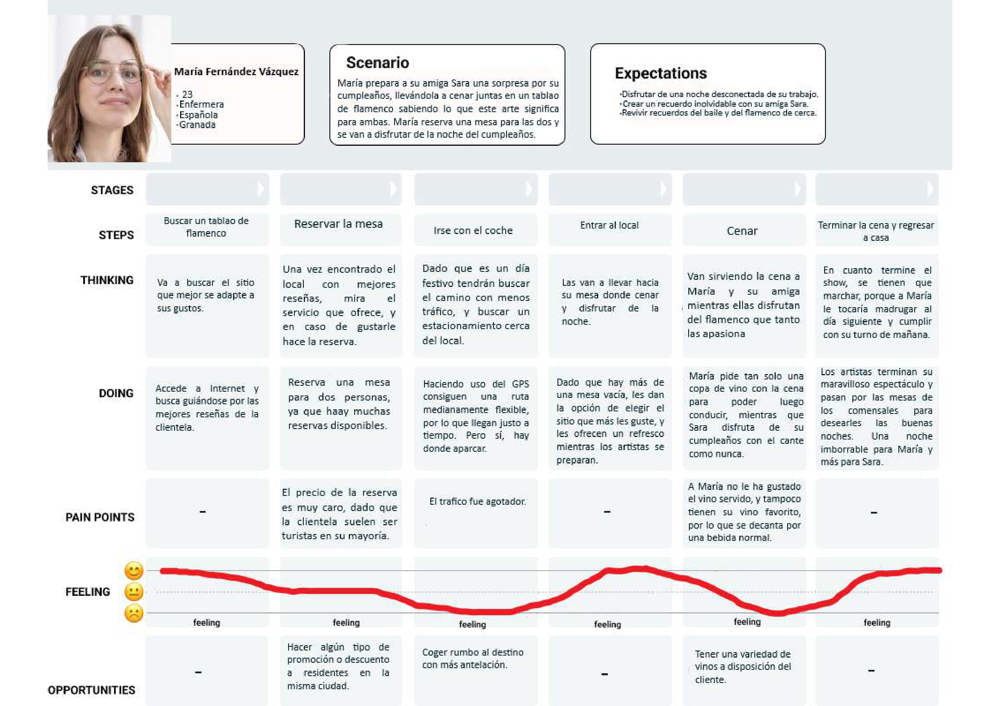
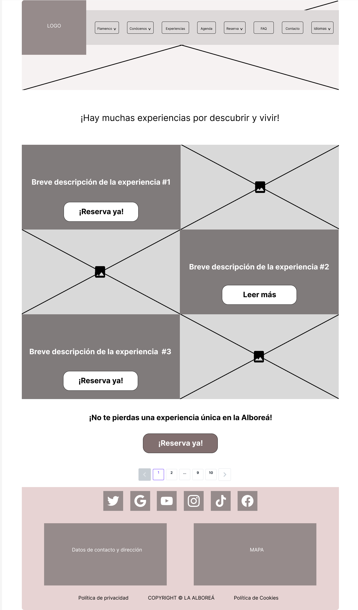
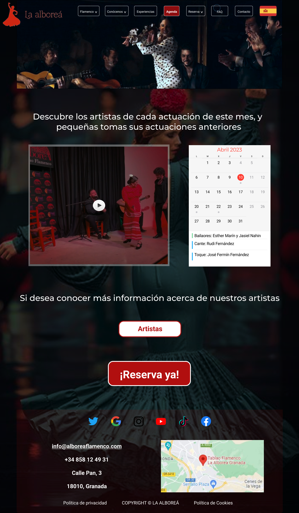

# DIU23
Prácticas Diseño Interfaces de Usuario 2022-23 (Tema: Tablao de Flamenco "La Alboreá" ) 

Grupo: DIU1_01AABB.  Curso: 2022/23 
Updated: 11/1/2023

Proyecto: 
>>> Decida el nombre corto de su propuesta en la práctica 2 

Descripción: 

>>> Describa la idea de su producto en la práctica 2 

Logotipo: 
>>> 

Miembros
 * :bust_in_silhouette:   Amine Azzammouri     :octocat:

----- 

# Proceso de Diseño 

## Paso 1. UX Desk Research & Analisis 

 1.a Competitive Analysis
-----

Es un análisis cuyo objetivo es hallar en qué competencias podrían suponer una rivalidad (mejor o peor), y en qué también debería de mejorar. En nuestro caso se tomaron dos ejemplos que ofrecen el mismo servicio, además de que son de la misma zona. Se ve claramente que el local asignado en la práctica “la Alboreá” destaca por encima de sus rivales en el aspecto tecnológico, ya que ofrece posibilidades más cómodas para el contacto, también destaca en cuanto a diseño o a producto ofrecido y variabilidad.

 1.b Persona
-----

•	**Valoración de las personas elegidas:**

__María__: Es una persona ideal para nuestro tema, porque de pequeña bailaba flamenco. O sea que es cercana a este mundo, al igual que su amiga, por lo que es lógico que si quiere disfrutar de algún momento especial no encontrará mejor sitio donde hacerlo que en un mundo al que ya perteneció.

**Min-Ho**: Me convenció esta persona también porque es de carácter aventurero, con ganas de explorar tradiciones y gastronomía nueva, por lo que un tablao de flamenco sería un escenario idóneo para una pareja de recién casados que quiere vivir momentos inolvidables juntos.

 1.c User Journey Map
----

En tales mapas se refleja cómo esas personas vivieron esa experiencia, qué problemas pudieron afrontar (con posibles remedios y soluciones) y cómo acabó la experiencia.

 1.d Usability Review
----
>>>  Revisión de usabilidad: (toma los siguientes documentos de referncia y verifica puntos de verificación de  usabilidad
>>>> SE deben incluir claramente los siguientes elementos
>>> - Enlace al documento:  [Usability Review](P1/Usability-review.pdf)
>>> - Valoración final (numérica): 7,5
>>> - Comentario sobre la valoración:  El sitio web cuenta con fácil acceso y navegación, ya que las tareas principales se encuentran en el menú de navegación que sobresale por los colores y el diseño empleado, no obstante, carece de interfaces de búsqueda las cuales serían de gran utilidad para el usuario. Las características y la funcionalidad permiten a los usuarios llevar a cabo adecuadamente sus operaciones gracias a la detallada descripción de los servicios del sitio web acompañados con soporte multimedia de imágenes y vídeos, aunque la distribución de las imágenes y el texto resulta un poco confusa en la página principal. La estructura de la aplicación permite a los usuarios llevar a cabo sus tareas de forma intuitiva y cuenta con indicadores del progreso de los procesos.

## Paso 2. UX Design  

 2.a Feedback Capture Grid / EMpathy map / POV
----

    
>>> ¿Que planteas como "propuesta de valor" para un nuevo diseño de aplicación para economia colaborativa ?
>>> Lo que se plantea como propuesta de valor es conseguir más interacción, y hacer que el diseño sea más llamativo y atractivo a pesar del uso abundante de colores apagados teniendo en cuenta el tema que estamos tratando "El Flamenco" que va siempre relacionado con colores agudos, y la misión es hacer que dichos colores atraigan más. 

 2.b ScopeCanvas
----
>>>  

 2.b Tasks analysis 
-----

>>> Fichero PDF: [Task matrix](P2/taskMatrix.pdf)
>>> En esta sección se recogen las tareas que pueden tener uso en la página web y se va valorando el uso que es previsto que le dé cada perfil de usuarios. Como conclusión, se puede observar que la mayoría de las tareas son relevantes para todos los perfiles de usuario, y que todas tienen una frecuencia de uso alta o media. Sin embargo, destacamos que la tarea de "Reservar entradas" es crítica e importante para todos los perfiles de usuario. 

 2.c IA: Sitemap + Labelling 
----

Término | Significado     
| ------------- | -------
  Inicio  | Se da la bienvenida al cliente y se le proporcionar lo que pueda necesitar (reserva, agenda, conocernos)
  Flamenco  | Sección para conocer más al flamenco (se divide en Historia, Accesorios, Eventos)
  Historia  | La historia del Flamenco a través de un vídeo subtitulado, junto con enlaces a (Accesorios, Eventos)
  Accesorios  | Accesorios típicos del flamenco
  Eventos | Eventos de Flamenco organizados en Granada, y opción de suscripción para recibir novedades
  Conócenos  | Sección dedicada a personas que nos visitan por primera vez. Presentamos a nuestro tablao, artistas y galería
  ¿Quiénes somos?  | La historia de "La Alboreá" a través de un vídeo subtitulado y enlace para los menús de cena
  Artistas  | Se presenta a nuestros artistas de cante, baile y guitarra
  Galería  | Es un archivo con tomas de actuaciones anteriores para que los nuevos clientes tengan idea del ambiente que se vive
  Experiencias  | Experiencias a vivir tanto en nuestro tablao de flamenco "La Alboreá" como en la ciudad de Granada
  Agenda  | Agenda del mes actual que informa de los artistas disponibles para un día concreto y highlights de actuaciones anteriores de dichos artistas
  Reserva  | Es la sección principal contiene: (Reservas, pautas a seguir, menús de cena, descuentos)
  Menús de cena  | Se presenta la variedad de menús de la que se dispone
  Promociones | Descuentos que se puedan aplicar a clientes
  ¡Reserva ya!  | Realizar la reserva y su pago
  ¡Tengo reserva!  | Pautas a tener en cuenta una vez que se haya reservado para vivir la mejor experiencia en La Alboreá
  Preguntas frecuentes¿?  | Colección de preguntas que se les suele ocurrir a los clientes, por lo que se responden allí para resolver dudas. Y se pone un enlace para contactar
  Contacto  | Formulario que debería rellenar el usuario para contactar con La Alboreá
  Idiomas  | Sección dedicada en especial para turistas para elegir el idioma que prefieran entre los disponibles

 2.d Wireframes
-----

>>> Plantear el  diseño del layout para Web/movil (organización y simulación ) 

## Paso 3. Mi UX-Case Study (diseño)

 3.a Moodboard
-----

>>> Plantear Diseño visual con una guía de estilos visual (moodboard) 
>>> Incluir Logotipo
>>> Si diseña un logotipo, explique la herramienta utilizada y la resolución empleada. ¿Puede usar esta imagen como cabecera de Twitter, por ejemplo, o necesita otra?

  3.b Landing Page
----

>>> Plantear Landing Page 

 3.c Guidelines
----

>>> Estudio de Guidelines y Patrones IU a usar 
>>> Tras documentarse, muestre las deciones tomadas sobre Patrones IU a usar para la fase siguiente de prototipado. 

  3.d Mockup
----

 3.e ¿My UX-Case Study?
-----

>>> Publicar my Case Study en Github..
>>> Documente y resuma el diseño de su producto en forma de video de 90 segundos aprox

## Paso 4. Evaluación 

 4.a Caso asignado
----

>>> Breve descripción del caso asignado con enlace a  su repositorio Github

 4.b User Testing
----

>>> Seleccione 4 personas ficticias. Exprese las ideas de posibles situaciones conflictivas de esa persona en las propuestas evaluadas. Asigne dos a Caso A y 2 al caso B
 

| Usuarios | Sexo/Edad     | Ocupación   |  Exp.TIC    | Personalidad | Plataforma | TestA/B
| ------------- | -------- | ----------- | ----------- | -----------  | ---------- | ----
| User1's name  | H / 18   | Estudiante  | Media       | Introvertido | Web.       | A 
| User2's name  | H / 18   | Estudiante  | Media       | Timido       | Web        | A 
| User3's name  | M / 35   | Abogado     | Baja        | Emocional    | móvil      | B 
| User4's name  | H / 18   | Estudiante  | Media       | Racional     | Web        | B 

. 4.c Cuestionario SUS
----

>>> Usaremos el **Cuestionario SUS** para valorar la satisfacción de cada usuario con el diseño (A/B) realizado. Para ello usamos la [hoja de cálculo](https://github.com/mgea/DIU19/blob/master/Cuestionario%20SUS%20DIU.xlsx) para calcular resultados sigiendo las pautas para usar la escala SUS e interpretar los resultados
http://usabilitygeek.com/how-to-use-the-system-usability-scale-sus-to-evaluate-the-usability-of-your-website/)
Para más información, consultar aquí sobre la [metodología SUS](https://cui.unige.ch/isi/icle-wiki/_media/ipm:test-suschapt.pdf)

>>> Adjuntar captura de imagen con los resultados + Valoración personal 

 4.d Usability Report
----

>> Añadir report de usabilidad para práctica B (la de los compañeros)

>>> Valoración personal 

>>> ## Paso 5. Evaluación de Accesibilidad  (no necesaria)

>>>   5.a Accesibility evaluation Report 
>>>> ----

>>> Indica qué pretendes evaluar (de accesibilidad) sobre qué APP y qué resultados has obtenido 

>>> 5.a) Evaluación de la Accesibilidad (con simuladores o verificación de WACG) 
>>> 5.b) Uso de simuladores de accesibilidad 

>>> (uso de tabla de datos, indicar herramientas usadas) 

>>> 5.c Breve resumen del estudio de accesibilidad (de práctica 1) y puntos fuertes y de mejora de los criterios de accesibilidad de tu diseño propuesto en Práctica 4.

## Conclusión final / Valoración de las prácticas

>>> (90-150 palabras) Opinión del proceso de desarrollo de diseño siguiendo metodología UX y valoración (positiva /negativa) de los resultados obtenidos  

